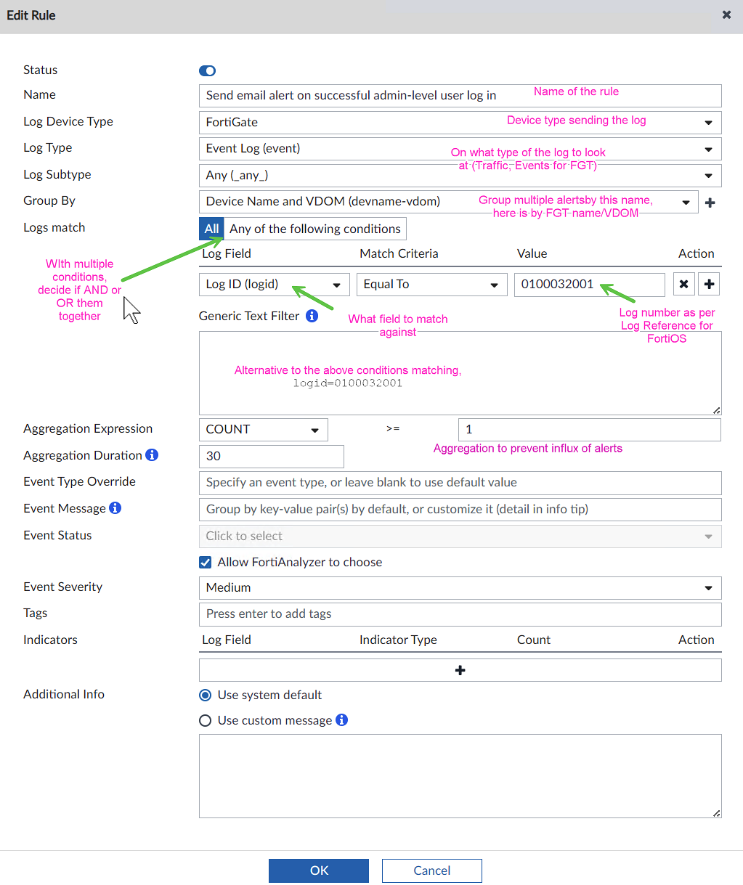

= Fortianalyzer Handlers collection

The collection is based on the Fortigate automation stitches one, making it scalable to multiple Fortigates that send their logs to the Fortianalyzer (FAZ).
As always, if you have an idea for a new Handler or find any errors - feel free to let me know. 

I tested and am using this collection in production environment, but cannot verify every possible device & versions combination, so test before using it. 

The Handlers are importable into the FAZ via _FortiSOC_ -> _Handlers_ -> _More_... -> _Import_. 

The Handlers do not contain the Notification profile, you'll have to set your own one - also done in _Incidents & Events_ -> _Handlers_ -> _Notification Profiles_. In older versions (6.4) you configure notifications directly inside the Handler. 

For email alerting, make sure to configure DNS and mail server settings in FAZ.

E.g.:

----
config system mail
    edit "mx.example.yurisk.info"
        set from "faz@example.yurisk.info"
        set server "mx.example.yurisk.info"
    next
end

config system dns
    set primary 10.100.0.2
end
----

Here is a GUI example, specifically of the _Send email on successful admin-level user log in_ Handler 

link:Admin-level-user-was-added.json[Admin-level user was added]

link:Admin-level-user-was-deleted.json[Admin-level user was deleted]

link:CPU-threshold-exceeded.json[CPU threshold exceeded]

link:Entered-conserve-mode.json[Entered conserve mode]

link:Fortigate-configuration-changed-by-administrator-with-details.json[Fortigate configuration changed by administrator]

link:Fortiguard-for-Webfiltering-is-unreachable.json[Fortiguard for Webfiltering is unreachable]

link:Memory-threshold-exceeded.json[Memory threshold exceeded]

link:Send-email-alert-on-successful-admin-level-user-log-in.json[Send email on successful admin-level user log in]