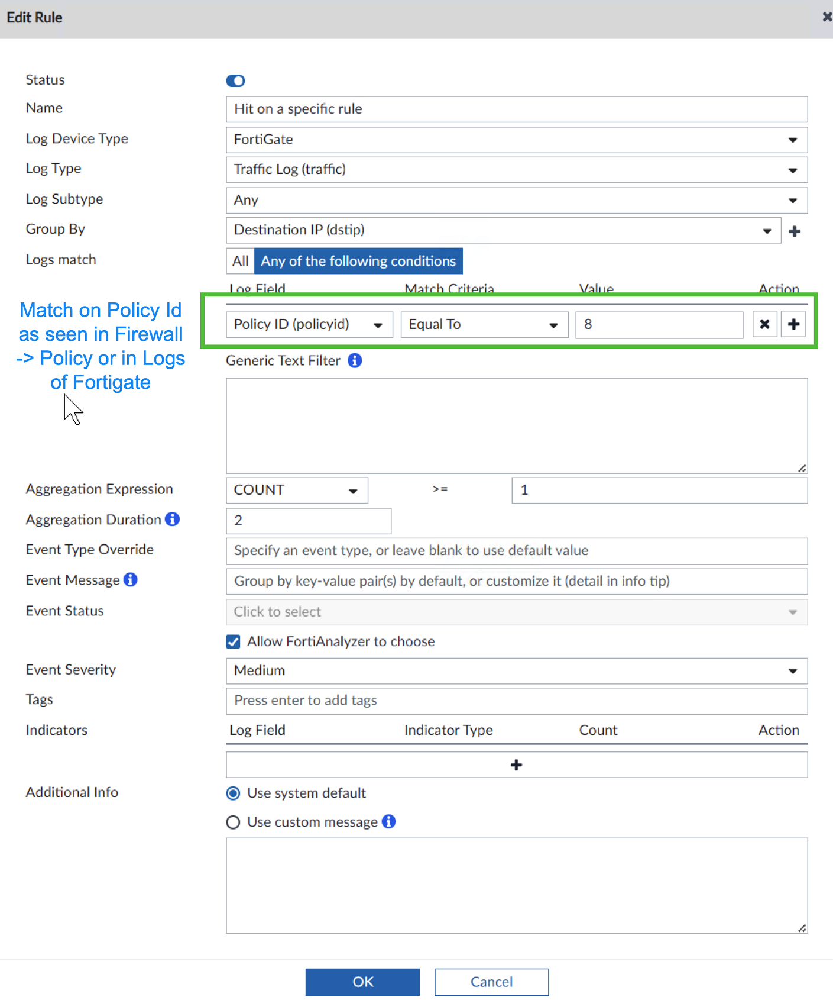

= Send email on specific security policy rule hit

This Handler will fire each time some packet(s) hit the given rule, and so may cause self-inflicted DoS on high volume rules, use with caution and set Aggregation to more agressive values. I do not provide JSON file as rule number which is the condition here, will differ in evey case.

This screenshot shows what to set for Handler to fire on `Policy id` number 8 being hit.

