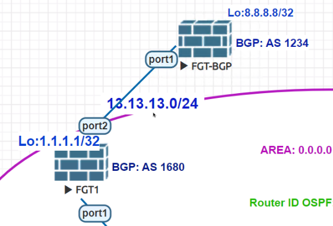

= Wireshark-ready packet captures
:toc: 

== Description

I collect here packet captures done on Fortinet equipment of different kinds, mostly on Fortigates, but not only.

== BGP

Topology for the packet capture:

Capture was done on FGT1. 

FGT1: 13.13.13.1

FGT-BGP: 13.13.13.13

NOTE: Disable rule colorization or it will be all red - limiations of virtual environment sniffing. 

link::https://github.com/yuriskinfo/Fortinet-tools/blob/main/Wireshark-ready-packet-captures/bgp-update-message-followed-by-withdraw-msg.pcap[bgp-initial-session-set-up-exchange-of-updates.pcap] - After BGP start, session is being established. First TCP port 179 connection is set up. The BGP OPEN messages are sent by both peers, then peers exchange UPDATE messages listing their routes (NLRIs). 

link::https://github.com/yuriskinfo/Fortinet-tools/blob/main/Wireshark-ready-packet-captures/bgp-initial-session-set-up-exchange-of-updates.pcap[bgp-initial-session-set-up-exchange-of-updates.pcap]  First packet is from FGT-BGP (13.13.13.13) with UPDATE message telling the peer of new route available (8.8.8.8/32). 2nd packet is the same FGT-BGP tells FGT1 about the route withdrawal (8.8.8.8/32). 